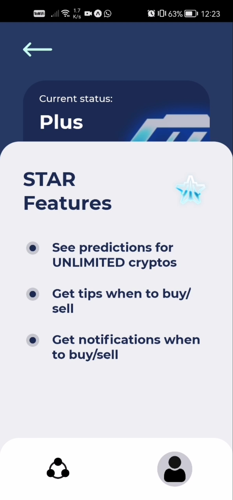

<div align="center">
  
</div>

## <div align="center">CryptoWizard - Magic of Cryptocurrencies! 🧙‍♂️️</div>

[](https://reactnative.dev/)
[](https://www.djangoproject.com/)

Welcome to CryptoWizard, your ultimate companion for navigating the enchanting world of cryptocurrencies. 🌟 With our mobile app developed using React Native 0.64.3 and Django, you'll harness the power of blockchain and AI to enhance your crypto experience. Let's dive into the mystical features that CryptoWizard has to offer:

🔗 Connect with Your Crypto Wallet
Connect seamlessly with your crypto wallet and unlock the door to the realm of digital currencies. Manage your assets and track your investments all in one place.

🏠 Enchanting Home Page
On the Home page, behold the mystical sight of all the coins you've invested in. Witness your profits and losses for each investment, along with the coins you follow closely. Stay one step ahead in the magical crypto realm.

<div>
  
</div>

💎 Choose Your Magical Subscription
Select from our range of spellbinding subscription plans: Bronze, Silver, Gold, Star, and Diamond. Each tier offers increasing features and benefits, with Bronze being absolutely FREE! Discover the plan that suits your needs and embark on your crypto journey with confidence.

<div>
  
</div>

💰 Tailored Features for Each Subscription
Based on your chosen subscription, CryptoWizard grants you a variety of powers:
- Track the prices of more or fewer coins to stay updated on their market value.
- Receive timely notifications for optimal buy/sell opportunities.
- Empower our trusty bot to handle trading on your behalf, saving you time and effort.

<div>
  
  
</div>

🧙‍♂️ Transaction History
Explore your detailed transaction history. Unveil the secrets of your crypto adventures.

<div>
  
</div>

🔮 Future Price Prediction Microservice 📈
Behold our magical microservice that harnesses the power of AI to predict the future prices of all cryptocurrencies in the market. Unleash the wisdom of our AI model and make informed decisions to maximize your profits.

<div>
  
</div>

---

## Backend API (Django)

Create virtual environment in repo (make sure you have python installed):
```bash
python -m venv venv
```

Activate venv:
```bash
venv\Scripts\activate
```

Install dependencies:
```bash
pip install -r requirements.txt
```

To create database tables
```bash
cd DjangoAPI
python manage.py makemigrations CryptoWizard
```

To migrate the changes form model to database 
```bash
python manage.py migrate CryptoWizard
```

To run the API:
```bash
python manage.py runserver
```

To access the server: 
```bash
localhost:8000
```

## Additional programs

To see the database install: [SQLiteStudio](https://sqlitestudio.pl/)